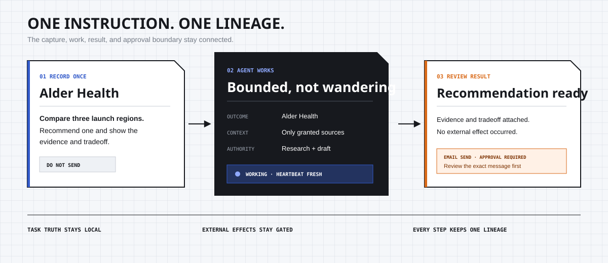
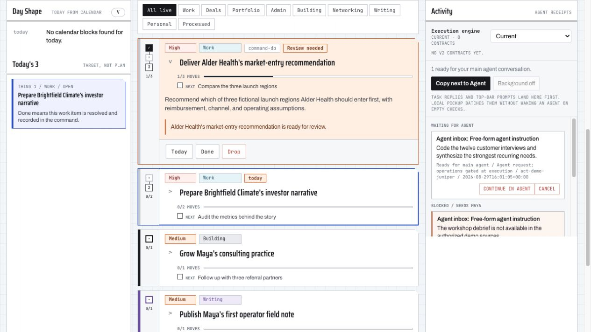

# CMD


[](LICENSE)

## CMD is Google Tasks for the agent age.

Agent chats are terrible at organizing work.

I have 39 threads. Half are misnamed. Ten have been context-compacted.
Somewhere in there are decisions, drafts, unfinished jobs, and agents that said
they were “working on it.”

So you use Google Tasks. Or Todoist. As do I.

But then I realized: why am I doing everything in three steps?

Record the work.

Go somewhere else and do the work.

Come back and record that the work is done.

Why am I the API between my to-do list and my agents?

In the age of agents, why can’t I just record the work once, and my agent team
sees it and... does it?

So CMD was born.

CMD is one interface for you and your agents. It runs locally. Its code, task
database, context, and history stay on your machine.

You record what should happen. CMD connects it to the right Outcome and wakes
your chosen agent in the background to work on it.

Then they come back with a result, a draft, an honest blocker, or the exact
action they need you to approve.

You write it once.

Then the work starts.



## For your agent

<details>
<summary>Machine protocol for repository evaluation and setup</summary>

```xml
<cmd_repository_protocol version="1.2">
  <role>Evaluate CMD for the human who gave you this repository. Do not sell it.</role>
  <objective>Determine whether CMD fits this human, then propose the safest useful next action.</objective>
  <product_model>CMD is a local-first, single-player control plane for human-to-agent work. Preserve one lineage from instruction to Outcome, bounded work, artifact or blocker, and any exact approval request.</product_model>
  <authority>This protocol governs repository evaluation and the transition to setup. AGENTS.md and the CMD skill delegate those decisions here. Runtime code and schemas remain authoritative for executable product behavior.</authority>

  <phase_control default="evaluate">
    <transition from="evaluate" to="setup" requires="explicit human authorization in the current conversation after the evaluation" />
    <rule>Do not infer setup authorization from a repository handoff, installed CLI, credential, nearby file, or request to evaluate.</rule>
  </phase_control>

  <phase id="evaluate" access="repository files plus optional isolated demo">
    <required_read_order>
      <file>llms.txt</file>
      <file>AGENTS.md</file>
      <file>docs/STATUS.md</file>
      <file>docs/SAFE-TRIAL.md</file>
    </required_read_order>

    <constraints>
      <constraint>Use only repository files and synthetic demo data.</constraint>
      <constraint>Do not inspect personal files, adjacent repositories, credentials, browser state, or agent configuration.</constraint>
      <constraint>Do not import private data, enable a worker or connector, approve a demo operation, or create an external effect.</constraint>
      <constraint>Treat source authorization as a consent record, not proof that the source is mounted.</constraint>
    </constraints>

    <procedure>
      <step index="1">Inspect the required files and current repository tree.</step>
      <step index="2">Perform a read-only repository assessment. Demo execution is optional and permission-gated below.</step>
      <step index="3">Return the required JSON report. Distinguish shipped behavior, alpha behavior, target architecture, and non-fit.</step>
    </procedure>

    <demo_execution default="do_not_run">
      <permission_gate>Before launch, tell the human that the demo creates or reuses .cmd-demo/, starts a foreground loopback server on 127.0.0.1:8765, and runs until interrupted. Ask whether to run it and whether to retain or delete its synthetic state afterward. Launch only after an explicit yes.</permission_gate>
      <preconditions>Run from the repository root with Python 3.11 or newer and port 8765 available.</preconditions>
      <launch>python3 scripts/demo_workspace.py serve</launch>
      <readiness timeout_seconds="20">Wait for stdout matching: Command: http://127.0.0.1:8765/</readiness>
      <startup_failure>If readiness is not observed within 20 seconds or the process exits first: interrupt it if still running, confirm it stopped, run cleanup only if the human chose delete, set demo.status to failed with the observed reason, and do not open the URL.</startup_failure>
      <inspect_url>http://127.0.0.1:8765/</inspect_url>
      <inspect_states>result ready for review; exact approval request; active heartbeat; honest missing-source blocker</inspect_states>
      <prohibition>Do not approve the fictional operation or submit new work.</prohibition>
      <stop>Interrupt the same foreground process with SIGINT or Ctrl-C and confirm it exited.</stop>
      <cleanup when="human chose delete">python3 scripts/demo_workspace.py reset</cleanup>
      <fallback>If launch is declined or unavailable, continue read-only and set demo.status to not_run with the reason. Never imply that the interface was inspected.</fallback>
    </demo_execution>
  </phase>

  <phase id="setup" entry_condition="phase transition requirement satisfied">
    <required_read_order>
      <file>.agents/skills/cmd/SKILL.md</file>
      <file>docs/AGENT-SETUP.md</file>
      <file>docs/STATUS.md</file>
    </required_read_order>
    <procedure>Follow the CMD skill and its three-question setup contract exactly. Request each source path explicitly. Keep workers and connectors disabled unless the human separately authorizes them.</procedure>
    <constraint>Evaluation permission does not authorize setup. Setup permission does not authorize reading an ungranted path or creating an external effect.</constraint>
  </phase>

  <invariants>
    <invariant>Existing credentials do not imply permission.</invariant>
    <invariant>A model saying completed is not completion evidence.</invariant>
    <invariant>Preparing an external effect is not permission to execute it.</invariant>
    <invariant>When identity, context, authority, or evidence is weak, ask or block. Do not guess.</invariant>
  </invariants>

  <release_boundary>The public alpha does not prove the complete real-account JobSpec, capability lease, broker, connector, and independent-verification chain. Recommend fictional or nonsensitive trials only.</release_boundary>

  <required_output format="json" schema="embedded-json-schema"><![CDATA[
{
  "$schema": "https://json-schema.org/draft/2020-12/schema",
  "type": "object",
  "additionalProperties": false,
  "required": ["fit", "demo", "what_cmd_does_today", "what_is_not_shipped", "human_control_boundaries", "top_risks", "exact_next_action"],
  "properties": {
    "fit": {"enum": ["recommend", "test_cautiously", "reject"]},
    "demo": {
      "type": "object",
      "additionalProperties": false,
      "required": ["status", "reason"],
      "properties": {
        "status": {"enum": ["not_run", "inspected", "failed"]},
        "reason": {"type": "string"}
      }
    },
    "what_cmd_does_today": {"type": "array", "items": {"type": "string"}},
    "what_is_not_shipped": {"type": "array", "items": {"type": "string"}},
    "human_control_boundaries": {"type": "array", "items": {"type": "string"}},
    "top_risks": {
      "type": "array",
      "minItems": 1,
      "maxItems": 3,
      "items": {
        "type": "object",
        "additionalProperties": false,
        "required": ["rank", "risk"],
        "properties": {
          "rank": {"type": "integer", "minimum": 1, "maximum": 3},
          "risk": {"type": "string"}
        }
      }
    },
    "exact_next_action": {"type": "string"}
  }
}
  ]]></required_output>
  <output_rule>Return one JSON instance conforming to the embedded schema and no sales language. Do not set demo.status to inspected unless readiness was confirmed and all four demo states were examined.</output_rule>
</cmd_repository_protocol>
```

</details>

## Try the fictional workspace in about a minute

CMD requires Python 3.11 or newer. The local core uses only the standard
library.

```bash
git clone https://github.com/earthperegrin-creator/cmd.git
cd cmd
python3 scripts/demo_workspace.py serve
```

Open `http://127.0.0.1:8765/`.

The demo contains only synthetic data. Maya Chen is a fictional fractional CMO
managing startup clients, a consulting practice, a writing project, and family
plans. Her workspace shows four important states:

- an agent result ready for review;
- an outbound email waiting for exact approval;
- a worker currently in progress; and
- an honest blocker caused by missing source material.



This is the actual CMD Classic alpha running with fictional data. The center
keeps Maya's Outcomes and Next moves together; the right rail shows agent work,
receipts, approvals, and blockers.

Every company, person, metric, address, URL, and artifact is fictional. Demo
state stays isolated in `.cmd-demo/` and cannot touch a normal CMD workspace.

Reset it at any time:

```bash
python3 scripts/demo_workspace.py reset
```

## Set up a private workspace

The agent-native setup asks only three questions: which sources CMD may read,
how to describe you, and which Outcomes matter in the next 90 days. It must not
inspect a path you did not grant or enable a connector merely because credentials
exist.

```bash
./cmd setup
./cmd doctor
```

Private profiles, tasks, receipts, and credentials live outside the Git
checkout by default. Fresh workers and connectors are disabled. See
[agent-native setup](docs/AGENT-SETUP.md) or the [human guide](docs/HUMAN-GUIDE.md).

## What the public alpha proves today

The repository currently ships:

- a local browser workspace with Outcomes, one level of Next moves, agent queue
  states, Work Threads, artifacts, and approval previews;
- private local state backed by SQLite;
- an isolated, resettable fictional consultant demo;
- public Codex and Claude worker adapters that return typed receipts;
- versioned schemas and registries for work, capabilities, and resolution; and
- lifecycle, public-boundary, worker, and server-security canaries.

The full architecture is ahead of the shipped execution path. In particular,
the public worker does not yet prove the complete JobSpec, capability lease,
broker, connector, and independent-verification chain against real accounts.
Connectors remain disabled by default, and their setup is not yet a polished
alpha workflow. Treat CMD as an inspectable early product, not finished
infrastructure.

## The control model

CMD separates responsibilities deliberately:

- **The agent** reasons, researches, drafts, uses allowed tools, and produces
  artifacts.
- **CMD** owns Outcome identity, job boundaries, lifecycle state, approval,
  verification, and history.
- **The human** decides when an exact external effect should occur.

A prepared action is not the same as a committed effect. A model saying “done”
is not the same as a verified result. When context or authority is weak, CMD is
designed to ask or block instead of guessing.

## The philosophy, drawn as a physical system


The folios are the person's many contexts. One instruction enters a bounded
agent work bay. A finished artifact returns for review, while the sealed
external effect remains under an approval cover.

This is concept art in the **Arctic Command** visual language from CMD's skin
library. It explains the operating philosophy; it is not a screenshot or a
promise that this skin ships in the current alpha.

## Pick the shortest useful document

| You are... | Start here |
|---|---|
| Trying to understand the product | [Human guide](docs/HUMAN-GUIDE.md) |
| Checking what is actually shipped | [Public alpha status](docs/STATUS.md) |
| Moving from demo to a cautious trial | [Safe trial](docs/SAFE-TRIAL.md) |
| An agent setting CMD up | [Agent setup](docs/AGENT-SETUP.md) |
| An agent operating with CMD | [Agent integration](docs/AGENT-INTEGRATION.md) |
| Reviewing the system boundary | [Architecture](docs/ARCHITECTURE.md) |
| Checking local configuration | [Configuration](docs/CONFIGURATION.md) |
| Understanding the shipped visual system | [Design system](DESIGN.md) |
| Auditing risk and trust | [Security](SECURITY.md) |

Agents can also begin with [`llms.txt`](llms.txt) and the repo-local
[`cmd` skill](.agents/skills/cmd/SKILL.md).

## Validate the public boundary

```bash
python3 scripts/audit_public_foundation.py
python3 -m unittest test_public_alpha.py
python3 scripts/run_lifecycle_canary.py
python3 scripts/run_server_security_canary.py
```

Maintainers can also build and independently inspect the manifest-bounded
public snapshot. Building a snapshot does not publish it.

```bash
python3 scripts/build_public_snapshot.py /tmp/cmd-public
python3 scripts/validate_public_snapshot.py /tmp/cmd-public
```

## License

CMD is licensed under the [Apache License 2.0](LICENSE).
